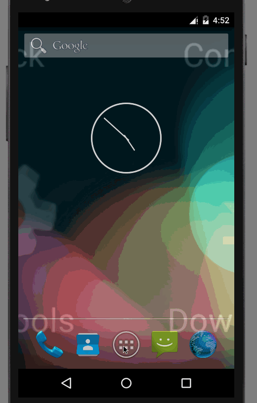

# Do! 
This is a simple Android application to make ToDo list . See the below link for cliffnotes for a step by step tutorial.

Time spent in total: 3 hours 

Completed user stories: 
* [x] Required: User can add a todo item to the list and the list is stored in the order of creation
* [x] Required: User can delete an item in the list by long click
* [x]  Required: User can edit the item in the list with a click on the item and the new edited item takes its place in the list.
	
 Notes:
 Spent some time giving the app an icon and make it cross compatible with all devices and resolution

Walkthrough of all user stories:

GIF created with [LiceCap](http://www.cockos.com/licecap/).
